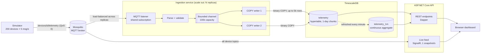

# IoT Telemetry Platform: .NET 8 · MQTT · TimescaleDB

    

A real-time IoT telemetry platform: a fleet of simulated sensors publishes over **MQTT**, a horizontally scalable **.NET ingestion service** bulk-loads readings into a **TimescaleDB hypertable**, and an **ASP.NET Core API** serves time-series queries plus a **live SignalR dashboard**.

It uses the patterns you need once device data reaches thousands of messages per second: shared subscriptions, bounded buffers, batched binary `COPY`, hypertables, native compression, retention policies and continuous aggregates.

```bash
docker compose up --build
# Dashboard → http://localhost:8080
```

---

## Architecture



### Ingestion path

1. **Simulator** publishes JSON readings (`temperature`, `humidity`, `battery`) to `devices/{deviceId}/telemetry`.
2. **Ingestion service** subscribes with an MQTT **shared subscription** (`$share/ingestion/devices/+/telemetry`). The broker load-balances messages across every replica, so throughput scales by adding instances: `docker compose up --scale ingestion=3`.
3. Each message is **parsed and validated** (topic shape, JSON, sane value ranges) using a source-generated `System.Text.Json` serializer. Bad messages are counted and rejected, never stored.
4. Valid readings go into a **bounded `Channel<T>`**. The MQTT callback never waits on the database. If the buffer is full, messages are shed and counted instead of stalling the broker connection.
5. **N concurrent writers** drain the channel in batches (up to 5,000 rows **or** 500 ms, whichever comes first) and load them with **PostgreSQL binary `COPY`**.
6. Failed writes are **retried with exponential backoff**. On shutdown, the listener completes the channel first and the writers **drain the buffer** before exiting.
7. Throughput, queue depth, rejected, dropped and failed counts are **logged every 10 seconds**.

### Query path

| Endpoint | What it does | TimescaleDB feature |
|---|---|---|
| `GET /api/devices` | Latest reading per device | `DISTINCT ON` over `(device_id, time DESC)` index, recent chunks only |
| `GET /api/devices/{id}/readings?minutes=15` | Raw readings for one device | Chunk exclusion on time range |
| `GET /api/devices/{id}/aggregates?hours=1` | 1-minute avg/max/min rollups | **Continuous aggregate** (real-time) |
| `GET /api/stats` | Row estimate, last-minute volume, storage size, chunk and compression counts | `approximate_row_count`, `hypertable_size`, chunk metadata |
| `GET /health` | Database connectivity check | – |
| `/hubs/telemetry` | Live device snapshot pushed once per second | SignalR (independent MQTT subscriber) |

---

## Data design

Everything lives in [`db/init.sql`](db/init.sql):

| Feature | Setting | Why |
|---|---|---|
| **Hypertable** | 1-day chunks on `time` | Inserts and time-bounded queries only touch recent chunks |
| **Index** | `(device_id, time DESC)` | Latest-per-device and per-device range queries |
| **Compression** | `segmentby = device_id`, `orderby = time DESC`, after 2 days | Each compressed segment is one device's ordered series, which compresses well and filters fast |
| **Retention** | Raw data 30 days, rollups 365 days | Old chunks are dropped whole, with no expensive `DELETE` or vacuum pressure |
| **Continuous aggregate** | `telemetry_1m`, refreshed every minute, `materialized_only = false` | Dashboards read small pre-computed rollups; the most recent minutes are merged in live |

---

## Key design decisions

| Decision | Alternative | Why |
|---|---|---|
| MQTT **shared subscription** | One subscriber, or partitioned topics | Horizontal scale-out with zero coordination code; the broker balances load |
| **Bounded** channel + load shedding | Unbounded queue / blocking | Memory stays predictable under bursts; drops are visible in metrics instead of causing an OOM crash |
| Binary **`COPY`** in batches | Row-by-row `INSERT` | Far fewer round-trips and less per-row overhead on the hot path |
| Size **or** time batch trigger | Fixed size only | Big batches under load, low latency when traffic is quiet |
| QoS 0 telemetry | QoS 1/2 | High-frequency sensor data tolerates occasional loss; QoS 0 avoids ack overhead. Switch to QoS 1 for critical events |
| **Continuous aggregate** for charts | `GROUP BY` over raw rows per request | Chart queries stay fast regardless of raw data volume |
| Live feed from MQTT, throttled to 1 snapshot/s | Pushing every message to browsers | The browser shows current state without being flooded |
| Validation at the edge | Store everything, clean later | One faulty sensor cannot pollute the time-series data |

---

## Running it

### Everything in Docker

```bash
docker compose up --build
```

| Service | URL / port |
|---|---|
| Dashboard + API | http://localhost:8080 |
| TimescaleDB | `localhost:5432` (postgres / postgres, db `telemetry`) |
| MQTT broker | `localhost:1883` |

Scale ingestion and change the load:

```bash
docker compose up --build --scale ingestion=3
# Edit Simulator__Devices / Simulator__RatePerDevice in docker-compose.yml
```

### Run services locally (for debugging)

```bash
docker compose up -d timescaledb mosquitto
dotnet run --project src/Telemetry.Ingestion
dotnet run --project src/Telemetry.Api
dotnet run --project src/Telemetry.Simulator -- --Simulator:Devices=500 --Simulator:RatePerDevice=10
```

### Try some queries

```sql
-- Chunks and compression status
SELECT chunk_name, range_start, is_compressed
FROM timescaledb_information.chunks WHERE hypertable_name = 'telemetry';

-- Hottest devices in the last 10 minutes, from the continuous aggregate
SELECT device_id, max(max_temperature) AS peak
FROM telemetry_1m WHERE bucket > now() - INTERVAL '10 minutes'
GROUP BY device_id ORDER BY peak DESC LIMIT 10;

-- Compress existing chunks now (normally done by the policy after 2 days)
SELECT compress_chunk(c, if_not_compressed => true) FROM show_chunks('telemetry') c;
SELECT pg_size_pretty(before_compression_total_bytes) AS before,
       pg_size_pretty(after_compression_total_bytes)  AS after
FROM hypertable_compression_stats('telemetry');
```

---

## Testing

```bash
dotnet test
```

- **Unit tests** cover payload parsing and validation (topics, malformed JSON, out-of-range values, serialize round-trip) and the size-or-time batching logic (full batches, partial flush on timeout, late arrivals, drain on completion, cancellation).
- **End-to-end CI** ([`.github/workflows/ci.yml`](.github/workflows/ci.yml)) starts the full Docker stack on every push, waits until simulated telemetry is flowing into TimescaleDB, then checks every API endpoint and the dashboard.

---

## Project structure

```
db/init.sql                    Hypertable, index, compression, retention, continuous aggregate
mosquitto/mosquitto.conf       MQTT broker config
src/
  Telemetry.Core/              Reading model, topic helpers, validated parser, BatchReader
  Telemetry.Ingestion/         MQTT listener → bounded channel → batched COPY writers + metrics
  Telemetry.Api/               REST (Dapper), SignalR live feed, dashboard (wwwroot)
  Telemetry.Simulator/         Random-walk sensor fleet publishing over MQTT
tests/Telemetry.Tests/         xUnit tests
Dockerfile                     One multi-stage image for every service (PROJECT build arg)
docker-compose.yml             Full local stack
```

## Tech stack

**.NET 8** · ASP.NET Core Minimal APIs · SignalR · `System.Threading.Channels` · **MQTTnet** · **Npgsql** (binary COPY) · Dapper · **TimescaleDB 2.17** (PostgreSQL 16) · Eclipse Mosquitto · Docker Compose · GitHub Actions · xUnit · Chart.js

## Roadmap

- [ ] Integration tests with Testcontainers
- [ ] OpenTelemetry metrics and traces, plus a Grafana dashboard
- [ ] k6 / MQTT load test with published throughput numbers
- [ ] Alert rules (e.g. temperature threshold) evaluated on ingest
- [ ] Device registry with PostGIS geofencing

## License

[MIT](LICENSE)
